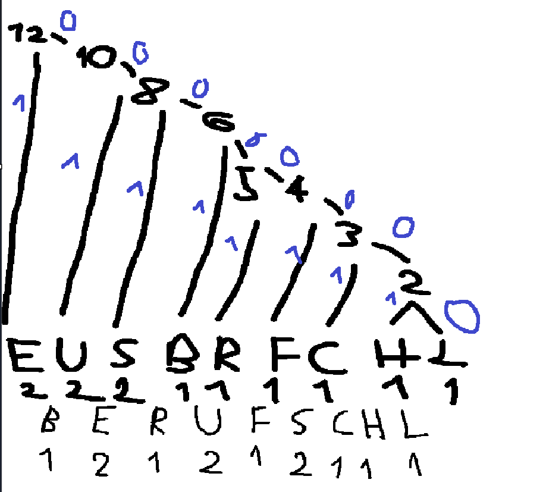
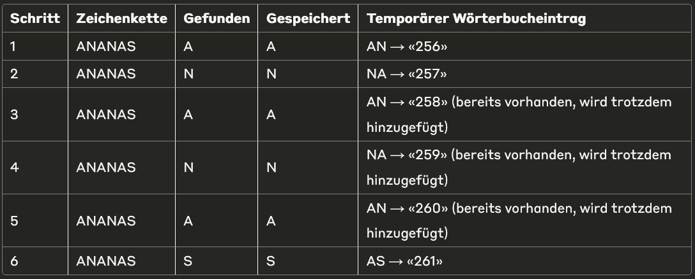
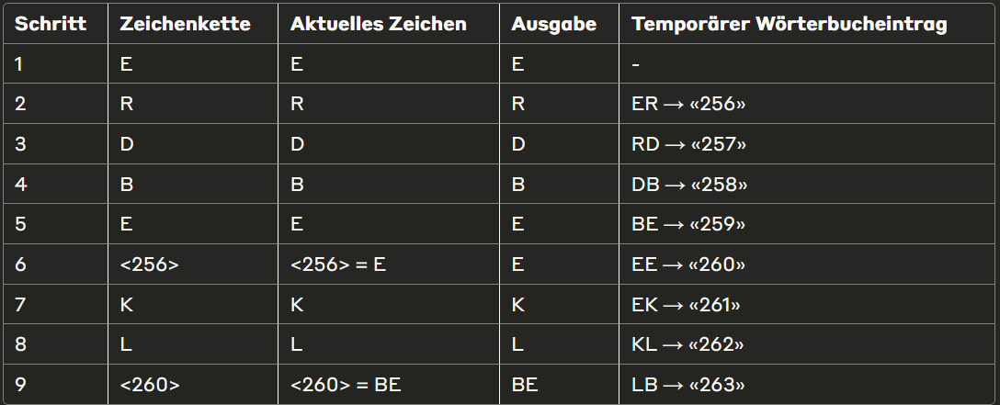

# Hufmann Aufgabe

Falsche Lösung: 

# RLE Aufgabe

# LZW Aufgabe
## 1)

Der LZW-Code wäre also: ANANAS

## 2)

ASCII-Zeichen:

E = 69

R = 82

D = 68

B = 66

K = 75

L = 76
Neue Codes ab 256
E → E

R → R
→ Wörterbuch: ER = 256

D → D
→ Wörterbuch: RD = 257

B → B
→ Wörterbuch: DB = 258

E → E
→ Wörterbuch: BE = 259

<256> → ER
→ Wörterbuch: EE = 260

K → K
→ Wörterbuch: RK = 261

L → L
→ Wörterbuch: KL = 262

<260> → EE

E R D B E ER K L EE → ERDBEERKLEE

# ZIP-Komprimierung Aufgaben
[Aufgaben Ordner](./LetzteAufgabe/)